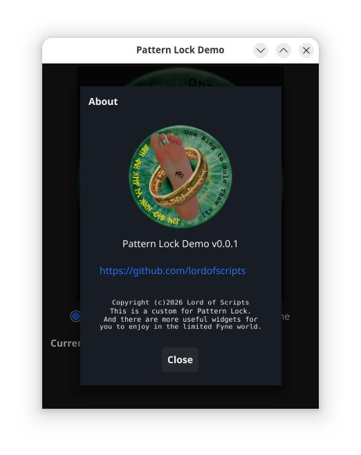

# Custom About Dialog

A custom **About** dialog that is suitable for the `Help | About`
menu item in your applications.

Features:

* Logo support (300x300)
* Uses Metadata
* Optional URL

## Usage

Add the module to your GO application

> go get github.com/lordofscripts/gofynex

Add it into the GO source of your Fyne application

> import "github.com/lordofscripts/gofynex/fynex"

Use the dialog:

> var myWin fyne.Window
> var logoResource fyne.Resource // usually an embedded resource
> var metadata fyne.AppMetadata = myApp.Metadata()
> var text string
> text = "This is an application I created for the fun of it."
> metadata["url"] = "https://github.com/lordofscripts"
> about := NewAboutBox(myWin, logoResource, metadata, text)
> about.ShowDialog()

Note, for applications built using `go` instead of `fyne package`
the application metadata will be incomplete. But Fyne has a lot of
quirkness and one of those is that you cannot set the metadata
directly. So, if you didn't use the `fyne` tool, get the application
metadata and fill in the missing parts (ID, Name, Version).

As you can see, you can also add custom metadata. In particular, the
About dialog looks for the `url` custom metadata. If it is present,
the About dialog will also display a URL Hyperlink widget under the
application name & version label.

