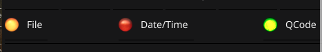

# LED Label Radio Widget

Ever needed to display a visual value that can be True, False or something in between (usually Not Set), like a tri-state value with a label identifying
the name of the value or parameter? Yes, it is great for UI dashboards.

Features:

* The tri-state (True, False, Not Set) is displayed as a Green, Red 
  or Yellow LED.
* It displays a label next to it, like a radio box or checkbox.
  
The introduced `TriState` enumeration type might be useful for other
purposes as well. 

### Sponsor Me

If you like my work -which takes useful free time that you don't have to spend- please
consider [Sponsoring ️❤️ me](https://github.com/sponsors/lordofscripts). Or...

