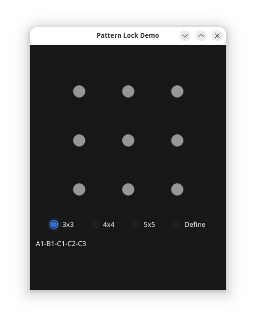
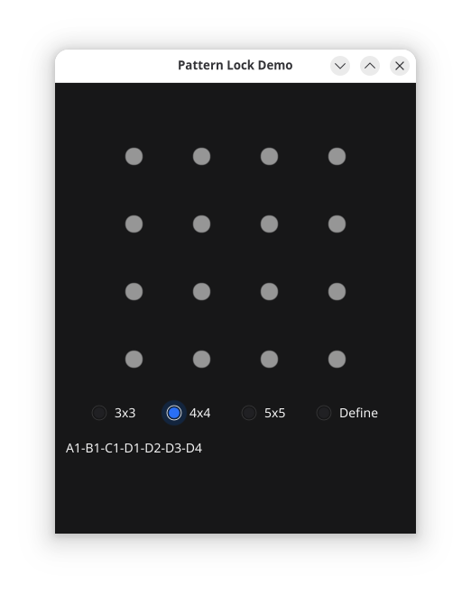
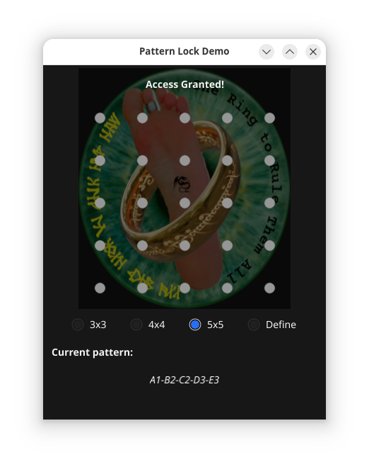

# PATTERN LOCK WIDGET


We all know the screen unlock feature of most smartphones: a 3x3 pattern.
The idea is that a pattern can be defined and validated. Here, such a
Fyne widget comes to life with the addition that it can be configured
for a 3x3 or 4x4 pattern.

## Features

* Uses the Fyne multi-platform Go GUI library
* 3x3, 4x4 and 5x5 Grids.
* Draws lines between the dots as the pattern is drawn by the user
* Validates the pattern
* The application (main) shows how to design a pattern
* Custom non-modal window where log messages are redirected.

### Grid Addressing

We use a **square grid**. The supported grids can be specified in two manners:

* By dot indexing (internal format)
* By friendly dot name

In the *dot indexing* manner every dot is uniquely identified by a 0-based
integer. The first dot (0) is at the top left, and the numbering increases
from left to right and top to bottom.

In the *friendly dot name* manner, we use human readable names based on
the Cartessian system. The columns are named A,B,C, etc. with the last
column name depending on the `PatternMode`. And the rows are 1-based 
numbered from top to bottom; thus, 1,2,3...n with the last row number
depending on the same `PatternMode`.

Here is the 3x3 grid selected by `PatternMode3x3`:



>	 	   3x3
>		A	B	C
>	  +------------
>	1 |	0	1	2
>	2 |	3	4	5
>	3 |	6	7	8

With dot indices from `0..8` and dot names `A1..C3`.

Here is the 4x4 grid selected by `PatternMode4x4`:



>	 		 4x4
>		A	B	C	D
>	  +-----------------
>	1 |	0	1	2	3
>	2 |	4	5	6	7
>	3 |	8	9	10	11
>	4 |	12	13	14	15

With dot indices from `0..15` and dot names `A1..D4`.

Here is the 5x5 grid selected by `PatternMode5x5` with a background
picture (optional):



>	 		   5x5
>		A	B	C	D	E
>	  +--------------------
>	1 |	0	1	2	3	4
>	2 |	5	6	7	8	9
>	3 | 10	11	12	13	14
>	4 | 15	16	17	18	19
>	5 |	20	21	22	23	24

With dot indices from `0..24` and dot names `A1..E5`.

## Use it on your GO project

First import it into your Go Module (project directory):

> go get github.com/lordofscripts/gofynex

Then import it in the source file you intend to use it:

> import "github.com/lordofscripts/gofynex"

In your **Fyne** app you will need two things then:

* The Pattern descriptor `*PatternInfo`
* The Pattern Lock custom widget `*PatternLock`

### The Pattern Info descriptor

You can define a fixed pattern, read it from a configuration
file, or whatever, but you need to create the *Pattern Descriptor*
that is passed to the widget for validation:

```go
    PATTERN_4x4, err := NewPattern([]int{0, 1, 2, 3, 7, 11, 15}, PatternMode4x4)
    if err != nil {
        Die(2, err.Error())
    }
```

That would be best if you use a pattern stored as 0-based *dot indices*.
Alternatively, you could specify the pattern as a sequence of strings
parts separated by `-` and 1-based row indices:

```go
    PATTERN_5x5, err = NewPatternFromString("A1-B1-C1-D1-E1-E2-E3-E4-E5", PatternMode5x5)
    if err != nil {
        Die(2, err.Error())
    }
```

## The Pattern Lock widget

This is the custom widget that lets you define and validate patterns
in various grids by letting the user draw connecting the dots.

For rendering a `PatternLock` widget ready for letting the user
define a new pattern:

```go
    const GRID_SIZE = 4
    lockDefW := NewPatternLock(GRID_SIZE, func(sequence []int){
        // store the new pattern
    })
    lockDefW.EnterDesignState()
```

And for rendering a `PatternLock` widget ready to validate a
predefined pattern:

```go
    // a pattern from storage or delivered by the "design" widget above.
    const GRID_SIZE = 4
    patternSequence := []int{0, 1, 2, 3, 7, 11, 15}
    myPattern, err := NewPattern(patternSequence, PatternMode4x4)
    if err != nil {
        println(err.Error())
    }
    
    GREEN := color.NRGBA{R: 0, G: 0x9d, B: 0, A: 255} // #009D00
    lockValW := NewPatternLockWith(myPattern, func(isValid bool) {
        log.Printf("OnValidated (user) is-valid: %t", isValid)
    })
    lockValW.SetSelectedColor(GREEN)
```

See it in action with a demonstration app:


### Sponsor Me

If you like my work -which takes useful free time that you don't have to spend- please
consider [Sponsoring ️❤️ me](https://github.com/sponsors/lordofscripts). Or...

[ ](https://BuyMeACoffee.com/lostinwriting)