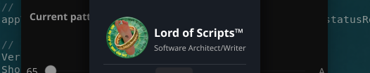

# Person (Developer) Widget

A nice chiclet widget that is used in the [About dialog](./DIALOG_ABOUT.md) to
display basic information about the developer:

* developer name
* developer title
* small 60x60 picture
* thin faint line at the bottom

The widget is integrated in the custom About dialog included in this module,
but you can use it anywhere in your Fyne app.

### Usage

Create the developer/person model with your choice of constructors:

> personModel := fynex.NewPersonWithImage("Lord of Scripts", "Dreamer", theme.AccountIcon())

Create the widget:

> personWidget := fynex.NewPersonWidgetWithModel(personModel)

Optionally override the name's foreground color, else the theme's will be used:

> personWidget.NameColor(ORANGE)

