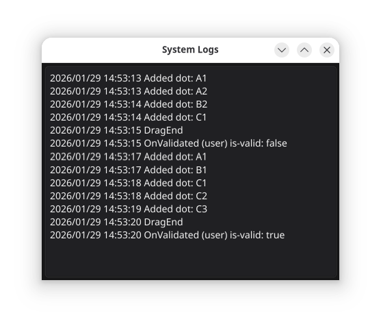

# Custom Log Window

A custom *non-modal* **Log** window that you can show and hide in your
Fyne application.

Features:

* Captures all log messages of the standard `log` package
* Non-modal window

## Usage

Add the module to your GO application

> go get github.com/lordofscripts/gofynex

Add it into the GO source of your Fyne application

> import "github.com/lordofscripts/gofynex/fynex"

Use the dialog:

> logWindow = fynex.NewLogWindow(app.GetApp(), 500, 600)
> logWindow.Show() // and continues execution of your app

In the demo application I define a `log` CLI flag and depending
on its value I instantiate the non-modal log window or not.

